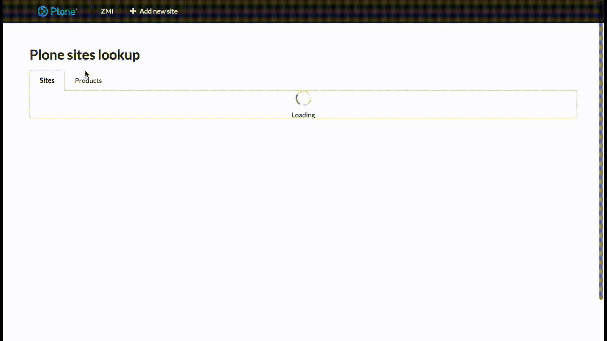

Introduction
============

This product override Plone's standard view for ZMI root with an overview of available Plone sites.

Features
========

- Possibility to have an overview about sites or products.
- In sites list, show which sites needs to upgrade some products, and manage products install/upgrade/uninstall profiles.
- In products list, show which sites installed a specific product, and manage install/upgrade/uninstall profiles for each site.

Installation
============

Install redturtle.lookup by adding it to your buildout::

    [buildout]

    ...

    eggs =
        redturtle.lookup

and then running ``bin/buildout``

How to use
==========

You simply need to go to your ZMI's root (for example: http://localhost:8080).

Development
===========

There are two main parts:

- api
- app

Api
---

Api folder is the folder where there are some api endpoints called from the frontend view to manage sites and products.

App
---

App folder contains a React app bootstrapped with create-react-app.

The app is bult with sematic-ui framework.

To develop, you need to start a Plone site in background:
you can use the buildout in this package, or the instance that you want.

In package.json there is a proxy set for 8080 port, so if your instance runs on another port, you need to change that value.

The first time that you develop react app, you need to install its dependencies::

    yarn
 
Then you need to run the dev server::

    yarn start
   
To build a new version of the app::

    yarn build

The new build will be automatically seen by the Plone view.

Contribute
==========

- Issue Tracker: https://github.com/RedTurtle/redturtle.lookup/issues
- Source Code: https://github.com/RedTurtle/redturtle.lookup

License
=======

The project is licensed under the GPLv2.

Authors
=======

This product was developed by RedTurtle Technology team.

.. image:: http://www.redturtle.it/redturtle_banner.png
   :alt: RedTurtle Technology Site
   :target: http://www.redturtle.it/
